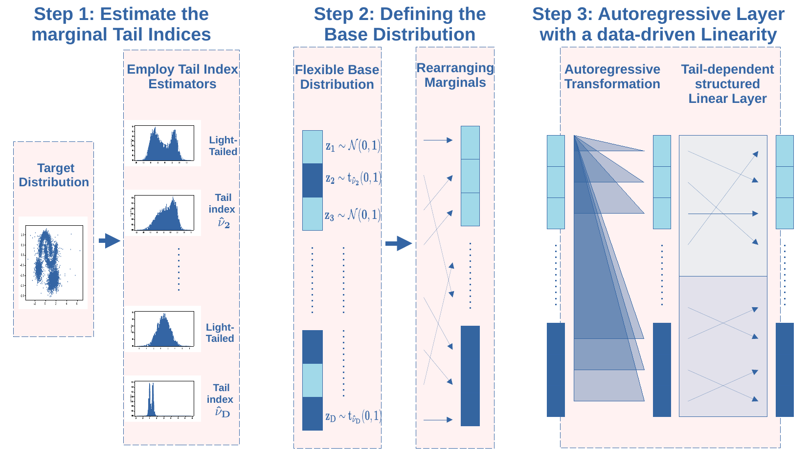

# Marginal Tail-Adaptive Normalizing Flows

by
Mike Laszkiewicz,
Johannes Lederer,
Asja Fischer.

This paper has been accepted at ICML 2022.

> Learning the tail behavior of a distribution is a
notoriously difficult problem. By definition, the
number of samples from the tail is small, and deep
generative models, such as normalizing flows,
tend to concentrate on learning the body of the distribution. In this paper, we focus on improving the
ability of normalizing flows to correctly capture
the tail behavior and, thus, form more accurate
models. We prove that the marginal tailedness
of an autoregressive flow can be controlled via
the tailedness of the marginals of its base distribution. This theoretical insight leads us to a
novel type of flows based on flexible base distributions and data-driven linear layers. An empirical analysis shows that the proposed method
improves on the accuracy—especially on the tails
of the distribution—and is able to generate heavy-
tailed data. We demonstrate its application on a
weather and climate example, in which capturing
the tail behavior is essential. 



*An Overview of mTAF. In a first step, we apply estimators from extreme value theory to classify the marginals as heavy- or
light-tailed. This classification defines a flexible base distribution consisting of marginal Gaussians and marginal t-distributions with
flexible degree of freedom, as illustrated by Step 2 of this figure. Further, we rearrange the marginals such that the first $d_l$ marginals are
light-tailed, whereas the remaining marginals are heavy-tailed. mTAF is then constructed using several flow-layers as visualized in Step 3:
we employ a triangular mapping, followed by a 2-group permutation scheme, which can be generalized to general 2-group linearities. At the end,
we restore the original ordering using the inverse of the permutation employed in Step 2. We prove that mTAFs are marginally tail-adaptive.*


## Software implementation
All source code used to generate the results and figures from Section 4.1 and 4.2 are in
the `synthetic_experiments` and in the `real_world_experiments` directory, respectively.
The code generates new directories, such as `real_world_experiments/plots/` and `real_world_experiments/results/`,
which store the plots and further quantitative metrics. 
In addition, results are tracked via [Weights & Biases](https://wandb.ai/site) (wandb).

## Dependencies
Install required packages using:
    
    pip install -r requirements.txt

## Synthetic Experiments 
Navigate to the corresponding folder: 

    cd synthetic_experiments
    
    
1. `main.py` runs the training and evaluation of a model on synthetic data. For all optional arguments, such as the flow architecture, the number of layers, 
and so on, please run 
    ```
    python3 main.py -h 
    ```
   
2. The bash script `run_nsf_df2.sh` executes `main.py` mutiple to produce the simulation results from the experimental study using 
    - a *Neural Spline Flow* architecture and
    - synthetic data with a degree of freedom equal to $2$ for the heavy-tailed components.
    
    See Section 4.1 for more details. Similarly, `run_maf_df2.sh` executes the simulation study with Neural Spline Flows being replaced by *Masked Autoregressive Flows*. Run `run_nsf_df3.sh` 
and `run_maf_df3.sh` to execute the experiments with a degree of freedom set to $3$. `run_copula_D8.sh` runs the copula baseline experiment. 

3. Summarize the results (in addition to tracking via wandb) and create plots similar to Figure 2 by running 
    ```
    python3 summarize_results.py
    ```
    
4. `run_nsf_D50.sh` and `run_copula_D50.sh` execute the $50$-dimensional experiments, see Table 5.
  
All results can be accessed via wandb and are located in `df<i>h<j>/`, where i is the degree of freedom and j is the number of heavy-tailed components
of the test distribution. 

## Climate Data
Navigate to the corresponding folder: 
    ```
    cd real_world_experiments 
    ```
1. `main.py` runs the training and the evaluation of a model on the weather dataset. For all optional arguments, such as the flow architecture, the number of layers, 
and so on, please run 
    ```
    python3 main.py -h 
    ```
2. The bash script `weather.sh` automates the simulation study for *vanilla*, *TAF*, *gTAF*, and *mTAF* using a Neural Spline Flow architecture.
For computational details, please refer to Section C. in the paper. 

3. Visualize the random statistics (see Section 4.2. in the paper) by running 
    ```
    python3 random_statistics.py 
    ```
after training the models. Additional arguments are displayed after running 
    ```
    python3 random_statistics.py -h 
    ```
    

## Citing mTAF
> @inproceedings{laszkiewicz2022mtaf,
  title={Marginal Tail-Adaptive Normalizing Flows},
  author={Laszkiewicz, Mike and Lederer, Johannes and Fischer, Asja},
  booktitle={International Conference on Machine Learning},
  pages={TBD--TBD},
  year={2022},
  organization={PMLR}
}
